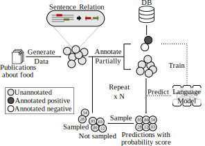

# Semi-Automated Construction of Food Composition Knowledge Base

A food composition knowledge base, which stores the essential phyto-, micro-, and macro-nutrients of foods is useful for both research and industrial applications. Although many existing knowledge bases attempt to curate such information, they are often limited by time-consuming manual curation processes. Outside of the food science domain, natural language processing methods that utilize pre-trained language models have recently shown promising results for extracting knowledge from unstructured text. In this work, we propose a semi-automated framework for constructing a knowledge base of food composition from the scientific literature available online. To this end, we utilize a pre-trained BioBERT language model in an active learning setup that allows the optimal use of limited training data. Our work demonstrates how human-in-the-loop models are a step toward AI-assisted food systems that scale well to the ever-increasing big data.



## Prerequisites

This code has been tested with
* Python 3.8

To prevent dependency problems, please use either conda or virtualenv.

```
# Activate Python virtualenv
python3 -mvenv env
source ./env/bin/activate

# Dectivate Python virtualenv
deactivate
```

## Running

### 1. Query LitSense and Generate PH pairs.

```
cd src/data_generation
python query_and_generate_ph_pairs.py
```

* Generates following output files.
	- ../../outputs/data_generation/query_results.txt
	- ../../outputs/data_generation/ph_pairs_{timestamp}.txt

### 2. Generate pre-annotation.

```
python generate_pre_annotation.py \
    --train_pre_annotation_filepath=../../outputs/data_generation/train_pool_pre_annotation.tsv
```

* Generates following output files.
	- ../../outputs/data_generation/train_pool_pre_annotation.tsv
	- ../../outputs/data_generation/val_pre_annotation.tsv
	- ../../outputs/data_generation/test_pre_annotation.tsv

### 3. (Manual) Annotate the pre_annotation files generated above. When finished, save the file names as below.

* Save the annotated files as follows.
	- ../../outputs/data_generation/train_pool_post_annotation.tsv
	- ../../outputs/data_generation/val_post_annotation.tsv
	- ../../outputs/data_generation/test_post_annotation.tsv

### 4. Post process the annotation.

```
python post_process_annotation.py \
    --train_post_annotation_filepath=../../outputs/data_generation/train_pool_post_annotation.tsv \
    --train_filepath=../../outputs/data_generation/train_pool.tsv
```

* Generates following output files.
	- ../../outputs/data_generation/train_pool.tsv
	- ../../outputs/data_generation/val.tsv
	- ../../outputs/data_generation/test.tsv


## Authors

* **Jason Youn** @ [https://github.com/jasonyoun](https://github.com/jasonyoun)
* **Fangzhou Li** @ [https://github.com/fangzhouli](https://github.com/fangzhouli)

## Contact

For any questions, please contact us at tagkopouloslab@ucdavis.edu.

## Citation

Put citation here. Let's use the exactly same format that is used in our [lab page](http://tagkopouloslab.ucdavis.edu/?page_id=648).

## License

This project is licensed under theApache-2.0 License. Please see the <code>[LICENSE](./LICENSE)</code> file for details.

## Acknowledgments

* We would like to thank the members of the Tagkopoulos lab for their suggestions, and Gabriel Simmons for the initial discussions.
* This work was supported by...
	- USDA-NIFA AI Institute for Next Generation Food Systems (AIFS), USDA-NIFA award number 2020-67021-32855
	- NIEHS grant P42ES004699
